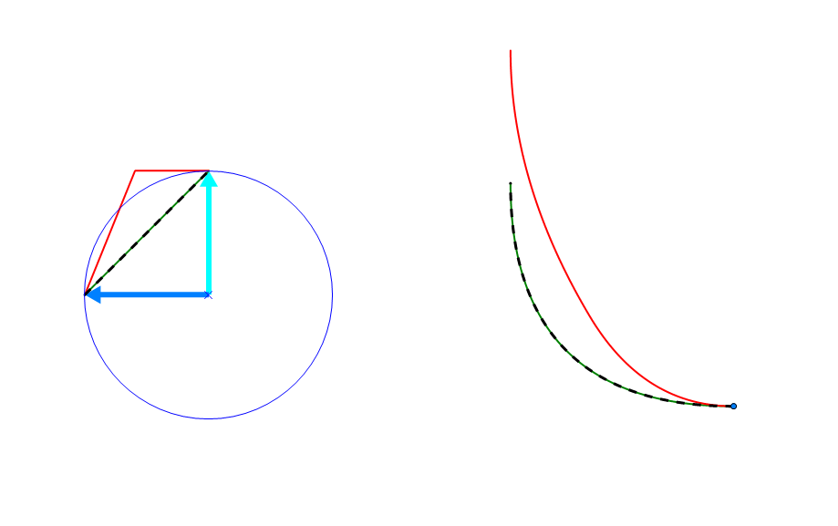
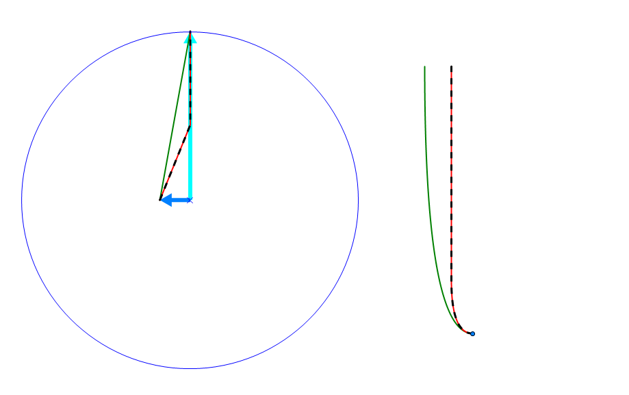
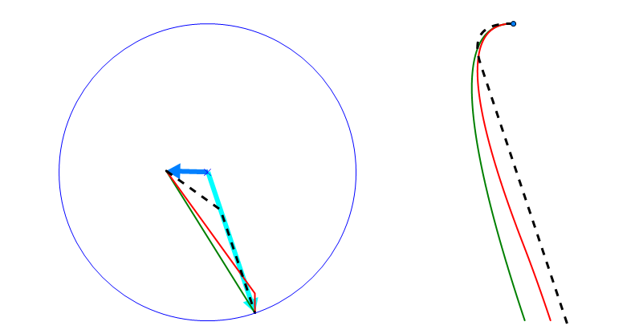
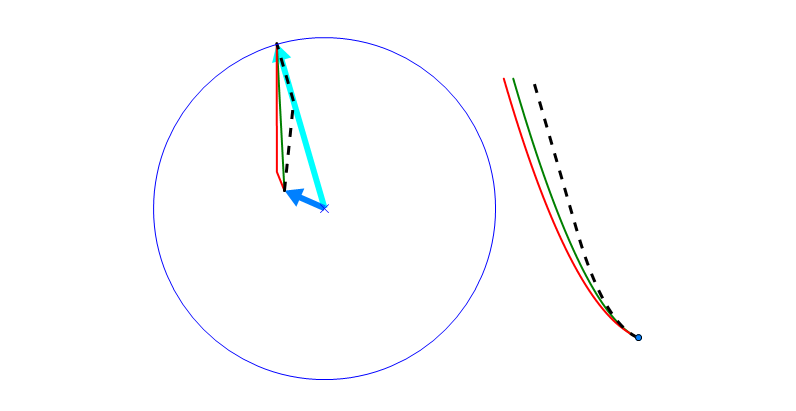
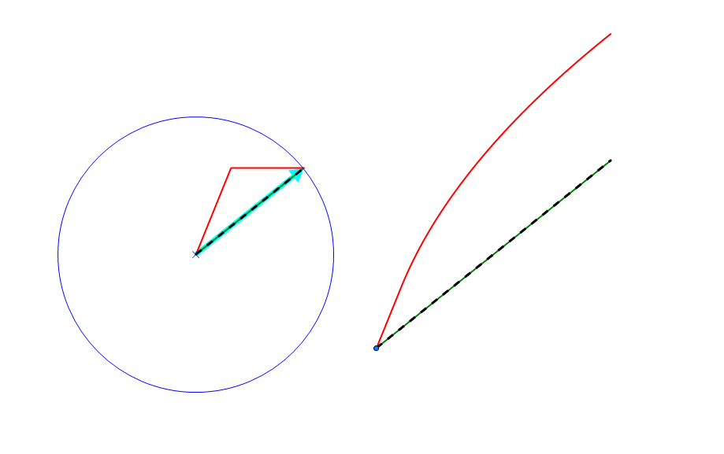
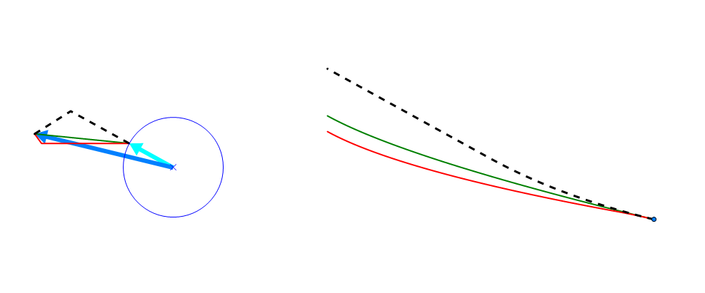
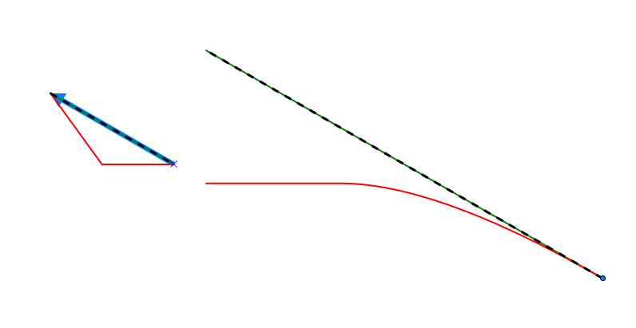
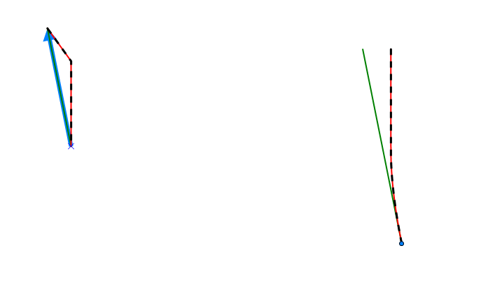
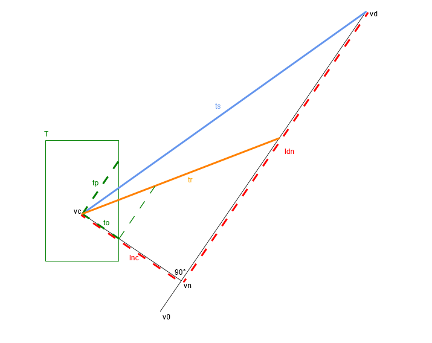

# SimpleFlightComputer

This repository contains code to test different concepts of how a spaceship in Star Citizen should apply thrust to achieve a desired velocity vector from a current velocity vector (coupled mode). A velocity vector describes the direction and speed the ship travels in.

In coupled mode the pilot specifies his desired velocity vector (strafe input depending on current ship orientation multiplied by speed limit (maximum ship speed when speed limit is disabled)).
The IFCS in coupled mode determines how to use your thrusters to achieve the new velocity vector in regards to your current velocity vector.
In other words the IFCS determines thrust power that each thruster has to perform to achieve the new velocity vector.
Regardless of the mode being used the flight computer is always subject to the same underlying physics and the same thrust restrictions of the spaceship.

## "max thrust" coupled mode
This mode always uses the maximum thrust power of each thruster resulting in different burn times for each thruster.
Setting PrioritizeStability to false will make the FlightComputer have this way.
This matches the IFCS of Star Citizen 3.9. 

## "stable" coupled mode
In 3.10 the IFCS now uses a thrust that has the same direction as the needed vector of velocity change. This results in a constant acceleration until the new velocity vector is achieved whereas before the acceleration direction would change each time a thruster has reached it's needed burn time.
Setting PrioritizeStability to true and UseAntiDrift to false will result in this mode.

## "anti-drift stable" coupled mode
Setting PrioritizeStability and UseAntiDrift to true will improve the thrust output to counter drift. Drift is defined as any motion that is not in the direction of the desired velocity vector. It works for every possible direction of desired velocity vectors, not just when the pilot wants to fly straight forward.
In the first iteration of the anti-drift mode, the flight computer only made use of it's anti-drift behaviour when this would not increase the total time needed to achieve the desired velocity vector. This restriction has since been dropped to make the anti-drift behaviour work better in all cases and make it more predictable for the pilot. This has also greatly simplified the algorithm. The increase in total time is negligible.

## Comparison
The following pictures have been created from data generated by the algorithms found in this repository.
Although these are just 2D representations the algorithm uses 3D space.
They show a view from above with the spaceship aligned like this:

They illustrate the benefits and weaknesses of the different modes.

The left side shows the velocity vectors. The dark blue arrow is the current velocity vector and the light blue arrow is the desired velocity vector.
The blue circle shows the speed limit that is currently set by the pilot (maximum ship speed when speed limit is disabled).
The red line shows the path of how the velocity vector is transformed when the "max thrust" mode is used.
The green line is the "stable" mode and the dashed black line is the "anti-drift stable" mode.
While the IFCS is performing the maneuver the direction and speed of the ship can vary greatly between the three modes.

This can obviously have large impacts on the flight path which is shown on the right. 
The blue point shows the location of the ship when the maneuver is started and the lines show the different flight paths.
The end of the lines represent the position of the ship when the desired velocity vector is finally achieved. 
In theses examples the ship's thrust values and mass are set to those of an Avenger.
(All these parameters including any possible combination of current and desired velocity vector can be fully customized.)

This case is as follows. The ship is traveling sideways with having reached its currently set speed limit. The pilot now determines that he wants to go forward instead.
Because of the fact that the aft thrusters of the ship are stronger in the "max thrust" mode halfway through the maneuver they will have finished their work and only the side thrusters will still be firing resulting in a change of acceleration direction, but also that the ship will carry a lot more forward speed through most of the maneuver. 
This will also have the effect that for a part of the maneuver the ship will exceed the speed limit set by the pilot (which can have negative impacts on gimbal performance).
The two "stable" modes will throttle the aft thrusters to achieve stable acceleration throughout the maneuver. 
Typically the aft thrusters will overheat faster than side thrusters and because the aft thrusters are not going full power, this should make it possible to use the afterburner for a longer duration in the beginning of the maneuver than would be possible with the "max thrust" mode, which will slightly improve the forward speed but more importantly will make the "stable" modes outperform the "max thrust" mode when it comes to eliminating drift in cases like these.

This case is similar to the previous one but this time the pilot has no speed limit set or is currently traveling way below the speed limit.
This shows the main problem of the normal "stable" coupled mode which is used in Star Citizen 3.10, namely that it is very bad at countering the drift.
The improved "anti-drift stable" coupled mode is capable of determining that in cases like this it's more important to counter the drift as fast as possible than to have a purely constant acceleration.

This case shows that the "anti-drift stable" does not just work in special cases like the one above. Additionally once it has successfully countered the drift it will perfectly align with the desired acceleration direction resulting in a smoother flight path.

Similar as above, but this shows that the "anti-drift" mode even changes thrust direction along the lateral thrust axis during the maneuver to achieve a better flight path.

In this case the ship is currently in standstill and the pilot sets a new desired velocity vector. In "max thrust" mode the ship will accelerate in a direction that does not match the direction of the desired velocity vector resulting in flight path that is not straight. In both "stable" modes the flight path perfectly matches the desired direction.
This will be perfectly suited when trying to perform precise docking/landing maneuvers.

In this case the pilot wants to slow down, but also adjust flight direction. The anti-drift feature allows the pilot to more effectively steer while slowing down.

In this case the pilot decides that he wants to come to a full stop. Although the "max thrust" mode will ensure that the ship travels the shortest distance before coming to a full stop the flight path will be slightly unpredictable. Both stable modes will result in a straight flight path. 

This case shows the possibility to use brake steering with the "anti-drift" mode. This is done by specifying a desired flight direction (in this case foward) while at the same time setting the desired speed to 0. In game this could be represented by pressing spacebrake or setting speed limit to 0 while at the same time specifying strafe input.

## Conclusion
In all cases, I can think of, the "anti-drift stable" mode described here would be better suited than the simple "stable" mode currently implemented in Star Citizen 3.10.
Only in some very specific situations the basic "max thrust" mode might provide better results, but that might be mitigated by the fact that in these same situations "anti-drift stable" mode might allow for longer afterburner durations. So I would suggest that CIG updates their coupled mode to something similar to this "anti-drift stable" mode. Then they could still add a toggle to switch between "anti-drift stable" and "max thrust" coupled mode, but I don't think that would be necessary.

## Math

This following image explains the math used for computing the optimal thrust direction in the "anti-drift stable" mode. It's a top down view on a 3D vector space.

T: represents the thrust potential of the ship. Here a ship aligned BoundingBox is used (independent thrust axis). If not mistaken, as of 3.10 Star Citizen still uses this type. But this algorithm will work for any possible shape. The important part is that the maximum thrust in a given direction can be computed.

ts: thrust direction for stable accleration (vd-vc)
tr: thrust direction that will eliminate drift more effectively

v0: stand still
vc: current velocity vector
vd: desired velocity vector

vn: velocity vector that has same speed along desired velocity as the current velocity vector but no drift

ldn: length(vd-vn)
lnc: length(vn-vc)
tp: maximum thrust possible in the direction of the desired velocity vector (vd)
to: maximum thrust possible in the direction (vn-vc)

When ldn/lnc > tp/to then use tr which is (vn-vc) + (vd-vn)/ldn * lnc * tp/to, otherwise use ts.

## Source Code
The FlightComputer class is the most interesting class which takes a SpaceShip instance (containing information about the ship's capabilities, state, pilot's intentions) and computes the thrust values to apply. The different modes can be achieved by setting the FlighComputer's Mode property.
To generate the data how the velocity vector changes and results in a flight path, you can use the PerformManeuver method located in the Tests class.
